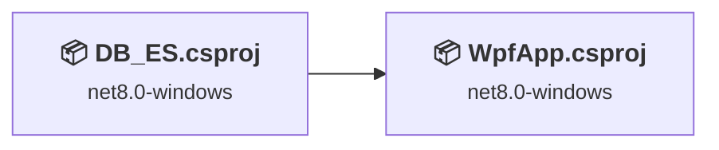
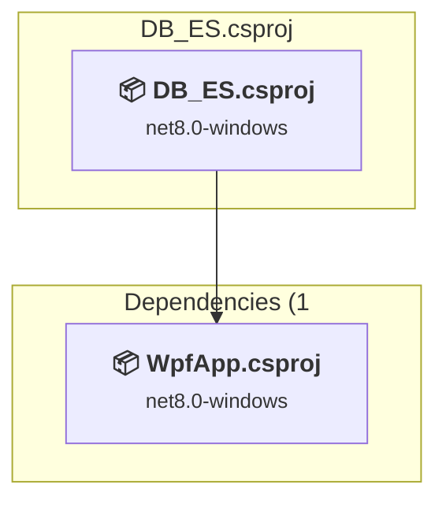
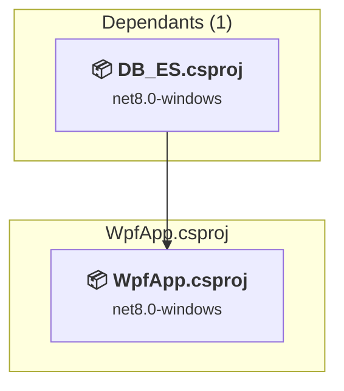

# Projects and dependencies analysis

This document provides a comprehensive overview of the projects and their dependencies in the context of upgrading to .NETCoreApp,Version=v10.0.

## Table of Contents

- [Executive Summary](#executive-Summary)
  - [Highlevel Metrics](#highlevel-metrics)
  - [Projects Compatibility](#projects-compatibility)
  - [Package Compatibility](#package-compatibility)
  - [API Compatibility](#api-compatibility)
- [Aggregate NuGet packages details](#aggregate-nuget-packages-details)
- [Top API Migration Challenges](#top-api-migration-challenges)
  - [Technologies and Features](#technologies-and-features)
  - [Most Frequent API Issues](#most-frequent-api-issues)
- [Projects Relationship Graph](#projects-relationship-graph)
- [Project Details](#project-details)

  - [DB_ES\DB_ES.csproj](#db_esdb_escsproj)
  - [WpfApp\WpfApp.csproj](#wpfappwpfappcsproj)

## Executive Summary

### Highlevel Metrics

| Metric | Count | Status |
| :--- | :---: | :--- |
| Total Projects | 2 | All require upgrade |
| Total NuGet Packages | 22 | 11 need upgrade |
| Total Code Files | 19 |  |
| Total Code Files with Incidents | 12 |  |
| Total Lines of Code | 1426 |  |
| Total Number of Issues | 95 |  |
| Estimated LOC to modify | 76+ | at least 5,3% of codebase |

### Projects Compatibility

| Project | Target Framework | Difficulty | Package Issues | API Issues | Est. LOC Impact | Description |
| :--- | :---: | :---: | :---: | :---: | :---: | :--- |
| [DB_ES\DB_ES.csproj](#db_esdb_escsproj) | net8.0-windows | 🟢 Low | 6 | 0 |  | DotNetCoreApp, Sdk Style = True |
| [WpfApp\WpfApp.csproj](#wpfappwpfappcsproj) | net8.0-windows | 🟡 Medium | 11 | 76 | 76+ | Wpf, Sdk Style = True |

### Package Compatibility

| Status | Count | Percentage |
| :--- | :---: | :---: |
| ✅ Compatible | 11 | 50,0% |
| ⚠️ Incompatible | 1 | 4,5% |
| 🔄 Upgrade Recommended | 10 | 45,5% |
| ***Total NuGet Packages*** | ***22*** | ***100%*** |

### API Compatibility

| Category | Count | Impact |
| :--- | :---: | :--- |
| 🔴 Binary Incompatible | 68 | High - Require code changes |
| 🟡 Source Incompatible | 0 | Medium - Needs re-compilation and potential conflicting API error fixing |
| 🔵 Behavioral change | 8 | Low - Behavioral changes that may require testing at runtime |
| ✅ Compatible | 2324 |  |
| ***Total APIs Analyzed*** | ***2400*** |  |

## Aggregate NuGet packages details

| Package | Current Version | Suggested Version | Projects | Description |
| :--- | :---: | :---: | :--- | :--- |
| CommunityToolkit.Mvvm | 8.4.0 |  | [DB_ES.csproj](#db_esdb_escsproj) [WpfApp.csproj](#wpfappwpfappcsproj) | ✅Compatible |
| EFCore.BulkExtensions | 9.0.2 |  | [DB_ES.csproj](#db_esdb_escsproj) [WpfApp.csproj](#wpfappwpfappcsproj) | ✅Compatible |
| Elastic.Clients.Elasticsearch | 9.2.0 |  | [DB_ES.csproj](#db_esdb_escsproj) [WpfApp.csproj](#wpfappwpfappcsproj) | ✅Compatible |
| Microsoft.EntityFrameworkCore.Design | 9.0.10 | 10.0.8 | [DB_ES.csproj](#db_esdb_escsproj) [WpfApp.csproj](#wpfappwpfappcsproj) | Ein NuGet-Paketupgrade wird empfohlen |
| Microsoft.EntityFrameworkCore.Tools | 9.0.10 | 10.0.8 | [DB_ES.csproj](#db_esdb_escsproj) [WpfApp.csproj](#wpfappwpfappcsproj) | Ein NuGet-Paketupgrade wird empfohlen |
| Microsoft.Extensions.Caching.Memory | 9.0.10 | 10.0.8 | [DB_ES.csproj](#db_esdb_escsproj) [WpfApp.csproj](#wpfappwpfappcsproj) | Ein NuGet-Paketupgrade wird empfohlen |
| Microsoft.Extensions.Configuration | 9.0.10 | 10.0.8 | [WpfApp.csproj](#wpfappwpfappcsproj) | Ein NuGet-Paketupgrade wird empfohlen |
| Microsoft.Extensions.Configuration.Json | 9.0.10 | 10.0.8 | [WpfApp.csproj](#wpfappwpfappcsproj) | Ein NuGet-Paketupgrade wird empfohlen |
| Microsoft.Extensions.Hosting | 9.0.10 | 10.0.8 | [WpfApp.csproj](#wpfappwpfappcsproj) | Ein NuGet-Paketupgrade wird empfohlen |
| Microsoft.Extensions.Hosting.Abstractions | 9.0.10 | 10.0.8 | [WpfApp.csproj](#wpfappwpfappcsproj) | Ein NuGet-Paketupgrade wird empfohlen |
| Microsoft.Extensions.Logging.Abstractions | 9.0.10 | 10.0.8 | [WpfApp.csproj](#wpfappwpfappcsproj) | Ein NuGet-Paketupgrade wird empfohlen |
| Microsoft.Extensions.Logging.Console | 9.0.10 | 10.0.8 | [DB_ES.csproj](#db_esdb_escsproj) [WpfApp.csproj](#wpfappwpfappcsproj) | Ein NuGet-Paketupgrade wird empfohlen |
| Microsoft.Extensions.Logging.Debug | 9.0.10 | 10.0.8 | [DB_ES.csproj](#db_esdb_escsproj) [WpfApp.csproj](#wpfappwpfappcsproj) | Ein NuGet-Paketupgrade wird empfohlen |
| Microsoft.Xaml.Behaviors.Wpf | 1.1.135 | 1.1.39 | [DB_ES.csproj](#db_esdb_escsproj) [WpfApp.csproj](#wpfappwpfappcsproj) | ⚠️Das NuGet-Paket ist nicht kompatibel |
| MySql.Data | 9.5.0 |  | [DB_ES.csproj](#db_esdb_escsproj) [WpfApp.csproj](#wpfappwpfappcsproj) | ✅Compatible |
| Newtonsoft.Json | 13.0.4 |  | [WpfApp.csproj](#wpfappwpfappcsproj) | ✅Compatible |
| Pomelo.EntityFrameworkCore.MySql | 9.0.0 |  | [DB_ES.csproj](#db_esdb_escsproj) [WpfApp.csproj](#wpfappwpfappcsproj) | ✅Compatible |
| Serilog | 4.3.0 |  | [WpfApp.csproj](#wpfappwpfappcsproj) | ✅Compatible |
| Serilog.Extensions.Hosting | 9.0.0 |  | [WpfApp.csproj](#wpfappwpfappcsproj) | ✅Compatible |
| Serilog.Extensions.Logging | 9.0.2 |  | [WpfApp.csproj](#wpfappwpfappcsproj) | ✅Compatible |
| Serilog.Settings.Configuration | 9.0.0 |  | [WpfApp.csproj](#wpfappwpfappcsproj) | ✅Compatible |
| Serilog.Sinks.File | 7.0.0 |  | [WpfApp.csproj](#wpfappwpfappcsproj) | ✅Compatible |

## Top API Migration Challenges

### Technologies and Features

| Technology | Issues | Percentage | Migration Path |
| :--- | :---: | :---: | :--- |
| WPF (Windows Presentation Foundation) | 25 | 32,9% | WPF APIs for building Windows desktop applications with XAML-based UI that are available in .NET on Windows. WPF provides rich desktop UI capabilities with data binding and styling. Enable Windows Desktop support: Option 1 (Recommended): Target net9.0-windows; Option 2: Add <UseWindowsDesktop>true</UseWindowsDesktop>. |

### Most Frequent API Issues

| API | Count | Percentage | Category |
| :--- | :---: | :---: | :--- |
| T:System.ComponentModel.ICollectionView | 11 | 14,5% | Binary Incompatible |
| T:System.Windows.Visibility | 11 | 14,5% | Binary Incompatible |
| T:System.Windows.Controls.ComboBox | 4 | 5,3% | Binary Incompatible |
| T:System.Windows.Controls.TextBox | 4 | 5,3% | Binary Incompatible |
| T:System.Uri | 3 | 3,9% | Behavioral Change |
| M:System.ComponentModel.ICollectionView.Refresh | 3 | 3,9% | Binary Incompatible |
| T:System.Xml.Serialization.XmlSerializer | 2 | 2,6% | Behavioral Change |
| T:System.Windows.Data.IValueConverter | 2 | 2,6% | Binary Incompatible |
| T:System.Windows.Data.Binding | 2 | 2,6% | Binary Incompatible |
| F:System.Windows.Data.Binding.DoNothing | 2 | 2,6% | Binary Incompatible |
| M:System.Uri.#ctor(System.String) | 2 | 2,6% | Behavioral Change |
| P:System.ComponentModel.ICollectionView.Filter | 2 | 2,6% | Binary Incompatible |
| T:System.Windows.Data.CollectionViewSource | 2 | 2,6% | Binary Incompatible |
| M:System.Windows.Data.CollectionViewSource.GetDefaultView(System.Object) | 2 | 2,6% | Binary Incompatible |
| M:System.Windows.Application.#ctor | 2 | 2,6% | Binary Incompatible |
| T:System.Windows.Application | 2 | 2,6% | Binary Incompatible |
| T:System.Windows.Controls.DatePicker | 2 | 2,6% | Binary Incompatible |
| T:System.Windows.Controls.StackPanel | 2 | 2,6% | Binary Incompatible |
| M:System.Windows.Window.#ctor | 2 | 2,6% | Binary Incompatible |
| M:System.Windows.Markup.InternalTypeHelper.#ctor | 1 | 1,3% | Binary Incompatible |
| T:System.Windows.Markup.InternalTypeHelper | 1 | 1,3% | Binary Incompatible |
| F:System.Windows.Visibility.Collapsed | 1 | 1,3% | Binary Incompatible |
| F:System.Windows.Visibility.Visible | 1 | 1,3% | Binary Incompatible |
| M:System.Windows.Application.Run | 1 | 1,3% | Binary Incompatible |
| T:System.Windows.ExitEventArgs | 1 | 1,3% | Binary Incompatible |
| M:System.Windows.Application.OnExit(System.Windows.ExitEventArgs) | 1 | 1,3% | Binary Incompatible |
| T:System.Windows.StartupEventArgs | 1 | 1,3% | Binary Incompatible |
| M:System.Windows.Application.OnStartup(System.Windows.StartupEventArgs) | 1 | 1,3% | Binary Incompatible |
| M:System.Windows.Window.Show | 1 | 1,3% | Binary Incompatible |
| M:System.Windows.Application.LoadComponent(System.Object,System.Uri) | 1 | 1,3% | Binary Incompatible |
| M:System.Uri.#ctor(System.String,System.UriKind) | 1 | 1,3% | Behavioral Change |
| T:System.Windows.Markup.IComponentConnector | 1 | 1,3% | Binary Incompatible |
| T:System.Windows.Window | 1 | 1,3% | Binary Incompatible |

## Projects Relationship Graph

Legend:
📦 SDK-style project
⚙️ Classic project

## Project Details

### DB_ES\DB_ES.csproj

#### Project Info

- **Current Target Framework:** net8.0-windows
- **Proposed Target Framework:** net10.0--windows
- **SDK-style**: True
- **Project Kind:** DotNetCoreApp
- **Dependencies**: 1
- **Dependants**: 0
- **Number of Files**: 2
- **Number of Files with Incidents**: 1
- **Lines of Code**: 70
- **Estimated LOC to modify**: 0+ (at least 0,0% of the project)

#### Dependency Graph

Legend:
📦 SDK-style project
⚙️ Classic project

### API Compatibility

| Category | Count | Impact |
| :--- | :---: | :--- |
| 🔴 Binary Incompatible | 0 | High - Require code changes |
| 🟡 Source Incompatible | 0 | Medium - Needs re-compilation and potential conflicting API error fixing |
| 🔵 Behavioral change | 0 | Low - Behavioral changes that may require testing at runtime |
| ✅ Compatible | 74 |  |
| ***Total APIs Analyzed*** | ***74*** |  |

### WpfApp\WpfApp.csproj

#### Project Info

- **Current Target Framework:** net8.0-windows
- **Proposed Target Framework:** net10.0-windows
- **SDK-style**: True
- **Project Kind:** Wpf
- **Dependencies**: 0
- **Dependants**: 1
- **Number of Files**: 17
- **Number of Files with Incidents**: 11
- **Lines of Code**: 1356
- **Estimated LOC to modify**: 76+ (at least 5,6% of the project)

#### Dependency Graph

Legend:
📦 SDK-style project
⚙️ Classic project

### API Compatibility

| Category | Count | Impact |
| :--- | :---: | :--- |
| 🔴 Binary Incompatible | 68 | High - Require code changes |
| 🟡 Source Incompatible | 0 | Medium - Needs re-compilation and potential conflicting API error fixing |
| 🔵 Behavioral change | 8 | Low - Behavioral changes that may require testing at runtime |
| ✅ Compatible | 2250 |  |
| ***Total APIs Analyzed*** | ***2326*** |  |

#### Project Technologies and Features

| Technology | Issues | Percentage | Migration Path |
| :--- | :---: | :---: | :--- |
| WPF (Windows Presentation Foundation) | 25 | 32,9% | WPF APIs for building Windows desktop applications with XAML-based UI that are available in .NET on Windows. WPF provides rich desktop UI capabilities with data binding and styling. Enable Windows Desktop support: Option 1 (Recommended): Target net9.0-windows; Option 2: Add <UseWindowsDesktop>true</UseWindowsDesktop>. |

